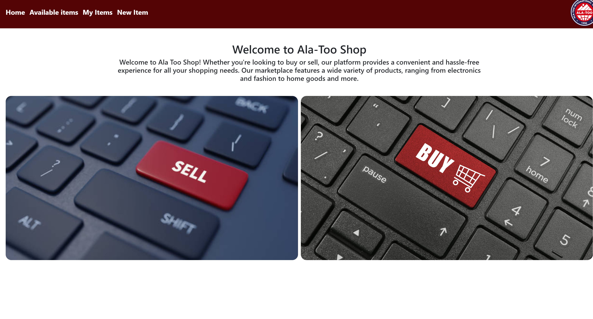

# University online shop application
> This website is for buying and selling any items

## Table of Contents
* [About](#About)
* [Screenshots](#screenshots)
* [Acknowledgements](#acknowledgements)
* [Contact](#contact)
<!-- * [License](#license) -->

## About
- This website is a platform where students can buy and sell their items
- The purpose of site is to make shopping between students easier

## Screenshots

### Items page

### My Items

### New Item

### Data inserted

### Item saved

### Validation

### Edit an item

### Edited item

## Project Status
Project is: _in progress_

## Acknowledgements

- Inspiration [video](https://youtu.be/xnur2ujza6k) which helped me a lot while doing this project  

## Contact
Created by [github.com](https://github.com/Arpidinov) - feel free to contact me!